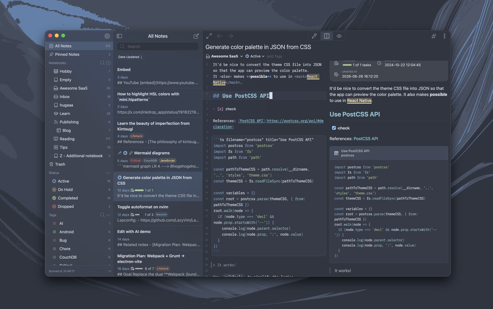

# nord-dark

An arctic, north-bluish Inkdrop **theme** based on the [Nord color palette](https://www.nordtheme.com/) — a single theme that styles the app UI, the editor syntax, and the Markdown preview.



<!-- Add your screenshot at docs/screenshot.png and reference it with a RELATIVE path
     (./docs/screenshot.png), not an absolute URL. The Inkdrop plugins website renders
     this README, and a relative path ships the image inside your package instead of
     loading it from a third-party server. -->

## How to install

```sh
ipm install nord-dark
```

Then enable it in **Preferences → Themes**.

## Development

```sh
npm install
ipm link   # symlink into your Inkdrop data dir for local testing
```

Edit the stylesheets in `styles/` — `tokens.css` (design-token ramps generated
from the Nord palette), `ui.css` (app chrome), `syntax.css` (editor), and
`preview.css` (Markdown preview), each wrapped in its `@layer` — then reload
Inkdrop to see your changes.

The Nord palette is too small to cover Inkdrop's Tailwind-style design tokens
directly, so `styles/tokens.css` overrides the built-in `--hsl-*` / `--color-*`
ramps with ramps generated from the 16 Nord colors: each family anchors a Nord
color at step 500 (hue and saturation held constant, lightness interpolated),
and in-between families (sky, amber, lime, …) blend two neighboring Nord hues.
The other stylesheets then only map Inkdrop's semantic variables onto those
ramps, following the [Nord style guidelines](https://www.nordtheme.com/docs/colors-and-palettes)
(keywords nord9, functions nord8, types nord7, strings nord14, numbers nord15, …).

`palette.json` is generated automatically on publish — `ipm publish` runs
`generate-palette` via the `prepublishOnly` script, so you don't commit it by hand.
